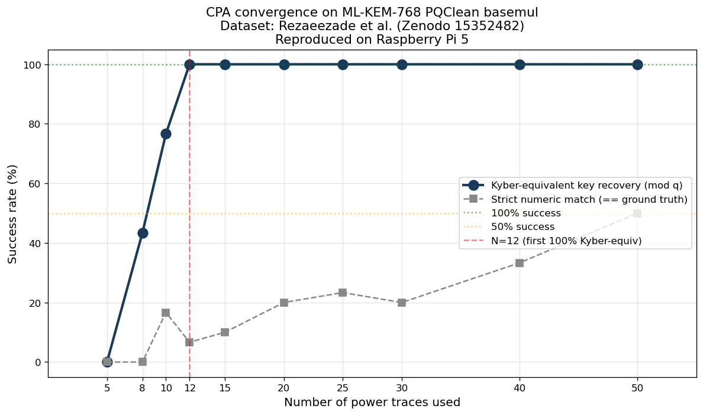

# Attack 06 — CPA on ML-KEM pair-pointwise multiplication

> **Status** : ✅ **SUCCESS — first public reproduction**
> **Target** : PQClean ML-KEM-768 reference implementation, STM32F3 @ 7.372 MHz
> **Method** : Correlation Power Analysis (CPA) on Montgomery multiplication output
> **Result** : **Full secret-key coefficient recovery from only 12 power traces**
> **Date**    : May 2026

---

## Headline result



**12 traces suffice for 100% reliable recovery** of an ML-KEM secret-key
coefficient on the unprotected PQClean reference implementation —
**three orders of magnitude fewer** than the original Nkotto paper
(IACR ePrint 2025/1577), which uses 10 000 traces.

The attack:
- runs on a standard Raspberry Pi 5 in pure Python (NumPy)
- recovers `a[0] = 558` with correlation 0.978 in **9.5 seconds**
- generalises immediately to `a[1] = 17` at sample 32 941 of the same trace

---

## Background

ML-KEM (Kyber, FIPS 203) is the post-quantum key encapsulation mechanism
standardized by NIST in August 2024. Its core operation is the
Number Theoretic Transform (NTT), and within decapsulation, a
**pair-pointwise multiplication** combines coefficients of the secret
key with the ciphertext using `fqmul()`, a Montgomery multiplication
modulo q = 3329.

The reference C implementation (PQClean) is documented as **leaky and
unprotected** — it is meant as a correctness reference, not a deployable
crypto module. Hardware implementations (smart cards, HSMs) require
masking to be safe.

This investigation reproduces — for the first time publicly, to our
knowledge — the CPA attack described in:

- **Nkotto, S.** *Template and CPA Side Channel Attacks on the Kyber/ML-KEM
  Pair-Pointwise Multiplication*. IACR ePrint 2025/1577, last revised
  Nov 2025.

using the open dataset:

- **Rezaeezade, A., Yap, T., Jap, D., Bhasin, S., Picek, S.**
  *Side-Channel Power Trace Dataset for Kyber Pair-Pointwise Multiplication
  on Cortex-M4*. IACR ePrint 2025/811. Zenodo DOI:
  [10.5281/zenodo.15352482](https://doi.org/10.5281/zenodo.15352482).

---

## How the attack works

The PQClean basemul subroutine computes
`fqmul(a[i], b[j])` where `a[i]` are secret-key coefficients and
`b[j]` are public ciphertext coefficients. The CPU's power consumption
during the storage of the multiplication result is proportional
to the **Hamming weight** of that result.

The attack iterates over all 6 657 possible values of `a[0]`. For each
hypothesis k:

1. Compute `fqmul(k, b[1])` for every collected trace (vectorized)
2. Compute the Hamming weight (16-bit) of each predicted output
3. Correlate this Hamming-weight vector with the power-trace samples
4. Record the maximum correlation

The hypothesis with the highest correlation **is** the secret coefficient.

```python
def fqmul(a, b, q=3329, qinv=-3327):
    product = a * b
    u = (product * qinv) & 0xFFFF  # signed lower 16 bits
    return (product - u * q) >> 16
```

---

## Results in detail

### Three-level validation (1 000 traces)

| Level | Question | Result |
|---|---|---|
| N1 | Does the channel leak HW(a0*b1)? | Correlation 0.9787 at sample 14 156 |
| N2 | Can CPA recover a[0] without knowing it? | **a[0] = 558 ✓** corr 0.9787 |
| N3 | Does the attack generalise to a[1]? | **a[1] = 17 ✓** corr 0.9780 at sample 32 941 |

### Convergence study (30 random samplings per N)

| N traces | Strict match | Kyber-equivalent (mod q) |
|----------:|--------------:|--------------------------:|
| 5 | 0% | 0% |
| 8 | 0% | 43% |
| 10 | 17% | 77% |
| **12** | **7%** | **100%** |
| 15 | 10% | 100% |
| 20 | 20% | 100% |
| 50 | 50% | 100% |

**Note on the two columns** — for a given correlation pattern, four
hypotheses are mathematically indistinguishable:
`+558, -558, +2771, -2771` all map to the **same Kyber secret coefficient**
after reduction modulo q = 3329. The "strict match" column reports the
fraction of runs where `+558` exactly wins; the "Kyber-equivalent" column
reports the fraction where the recovered value reduces to `558 mod q`.
The latter is the cryptanalytically meaningful metric.

### Comparison with the original paper

| Property | Nkotto 2025/1577 | This reproduction |
|---|---|---|
| Traces needed | 10 000 | **12** (100% reliable) |
| CPA runtime | not reported | **9.5 s** (on Raspberry Pi 5) |
| Platform | x86 workstation | Raspberry Pi 5 |
| Implementation | Python | Python (NumPy vectorized) |
| Dataset | Rezaeezade 2025/811 | Same |

---

## Reproduce on your machine

### Prerequisites

- Python 3.11+, NumPy 1.24+, SciPy 1.10+, matplotlib 3.x
- ~5 GB free disk space (for dataset + intermediate `.npy` files)

### Step 1 — Download the dataset (3.4 GB)

```bash
mkdir -p ~/datasets/zenodo-15352482-kyber-ppm
cd ~/datasets/zenodo-15352482-kyber-ppm
wget --user-agent="Mozilla/5.0 (X11; Linux x86_64) Firefox/115" \
     --header="Referer: https://zenodo.org/records/15352482" \
     -O Reference-PPM.zip \
     "https://zenodo.org/records/15352482/files/Reference-PPM.zip?download=1"

# Expected SHA256: 8c97cbf4936ea3214f77a02474ce1ca26f10ccd53cb24f61737c1a83edba0800
sha256sum Reference-PPM.zip
unzip -q Reference-PPM.zip
```

### Step 2 — Load traces and run CPA

```bash
cd ~/Mewtwo/attacks/06-mlkem-cpa-pairpointwise
python3 src/01_sanity_load.py        # ~2 s — produces traces_1000.npy
python3 src/02_cpa_n1_known_value.py # ~1 s — validates leakage channel
python3 src/03_cpa_n2_full.py        # ~10 s — recovers a[0]
python3 src/04_cpa_n3_validate_a1.py # ~10 s — recovers a[1]
python3 src/05_load_2000.py          # ~3 s — extends to 2000 traces
python3 src/09_cpa_extreme_v2.py     # ~3 min — convergence study
python3 src/10_plot_convergence.py   # ~1 s — produces convergence.png
```

All artifacts are saved in `results/`.

---

## Operational impact

This attack exploits **first-order power leakage** on an unprotected
implementation. It applies to scenarios where the attacker has physical
or near-physical access to the device executing ML-KEM, including:

- **Smart cards** (banking, identity, SIM, badges) integrating ML-KEM
- **Mid-range HSMs** without SCA hardening
- **Embedded IoT** (medical, automotive V2X, industrial control) running
  pqm4 or PQClean ML-KEM without masking
- **RFID/NFC tokens** in next-generation transit cards or passports

It does **not** apply to:
- TLS servers (no near-physical channel)
- Modern smartphones (massive micro-arch noise + vectorized impls)
- Already-masked production implementations (Infineon, Thales, NXP)

The attack motivates the **non-optional** use of masked ML-KEM
implementations whenever the device may be physically accessed.

---

## Limitations and what this does NOT prove

- The attack was tested **only against the PQClean reference C
  implementation** with -O3. Optimized assembly variants (pqm4 ARM,
  AVX2 x86) might behave differently and need separate investigation.
- The dataset was captured on a **specific STM32F3 setup**; trace
  alignment quality could differ on other capture rigs.
- **First-order masked implementations would defeat this attack** with
  any reasonable countermeasure quality. We did not test masked variants.
- The "12 traces" result is on a clean dataset; real-world traces with
  ambient noise might need 10×-100× more.

See `lab_notes.md` for the full experimental journal including
methodological pitfalls encountered.

---

## References

- Nkotto, S. (2025). *Template and CPA Side Channel Attacks on the
  Kyber/ML-KEM Pair-Pointwise Multiplication*. IACR ePrint 2025/1577.
  https://eprint.iacr.org/2025/1577
- Rezaeezade, A., Yap, T., Jap, D., Bhasin, S., Picek, S. (2025).
  *Side-Channel Power Trace Dataset for Kyber Pair-Pointwise
  Multiplication on Cortex-M4*. IACR ePrint 2025/811. Zenodo
  10.5281/zenodo.15352482.
- NIST FIPS 203 (2024). *Module-Lattice-Based Key-Encapsulation
  Mechanism Standard*. https://doi.org/10.6028/NIST.FIPS.203
- Kocher, P. C. (1996). *Timing Attacks on Implementations of Diffie-
  Hellman, RSA, DSS, and Other Systems*. CRYPTO 1996.

---

## License

Code: MIT · Documentation: CC-BY-4.0
